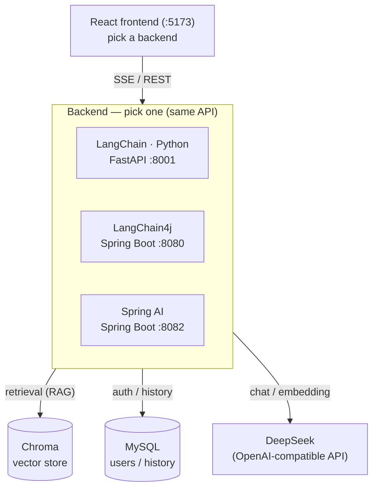

English | [简体中文](README.md)

# 🤖 Personal Knowledge Assistant · Three Implementations

> One **full-stack RAG knowledge assistant**, built three ways — with **LangChain (Python),
> LangChain4j, and Spring AI**. All three expose an identical API behind one React frontend:
> **switch the backend from a dropdown and watch three frameworks answer the same question.**

Pick the one that fits your stack — or run all three side by side.

| Implementation | Language / Framework | Port |
|------|----------|------|
| **LangChain (Python)** | Python + FastAPI | 8001 |
| **LangChain4j** | Java 21 + Spring Boot | 8080 |
| **Spring AI** | Java 21 + Spring Boot | 8082 |

## Preview


## Architecture



## ✨ Highlights

- 🔍 **RAG knowledge-base Q&A** — document embedding + retrieval-augmented generation, answers cite their sources
- 🛠️ **Agent + tool calling** — the model decides whether to search the knowledge base (function calling)
- ⚡ **Streaming output** — token-by-token over SSE, ChatGPT-style typewriter effect
- 👤 **Full user system** — JWT login, conversation history, rename, soft delete; history also feeds multi-turn context
- 🔄 **One frontend, three backends** — identical API, switch from a dropdown at zero cost
- 🧩 **Pluggable** — LLM (any OpenAI-compatible, DeepSeek by default), vector store (Chroma), embeddings — all swappable
- 📦 **Structured output** — free text → typed JSON

## Tech stack

- LLM: any OpenAI-compatible model (DeepSeek by default)
- Vector store: Chroma
- Embeddings: local BGE-small-zh (Python / LangChain4j) / all-MiniLM-L6-v2 (Spring AI)
- Relational DB: MySQL (users & conversation history)
- Frontend: React + Vite

## Quick start

1. **Environment variables**
   ```bash
   cp .env.example .env
   # fill in DEEPSEEK_API_KEY, MySQL connection, JWT_SECRET, etc.
   ```
2. **Create the database** (the user system needs MySQL)
   ```bash
   mysql -u root -p < db/schema.sql
   ```
3. **Start Chroma** (vector store)
   ```bash
   ./scripts/start-chroma.sh
   ```
4. **Start any one backend** (choose by your stack)
   ```bash
   ./scripts/start-python.sh        # 8001
   ./scripts/start-langchain4j.sh   # 8080
   ./scripts/start-springai.sh      # 8082
   ```
5. **Ingest the RAG corpus**: Python runs `./scripts/ingest-python.sh`; the two Java backends call `POST /ingest`
6. **Start the frontend**
   ```bash
   cd frontend && npm install && npm run dev   # http://localhost:5173
   ```

See each implementation's own README for API details.

## License

[MIT](LICENSE)
