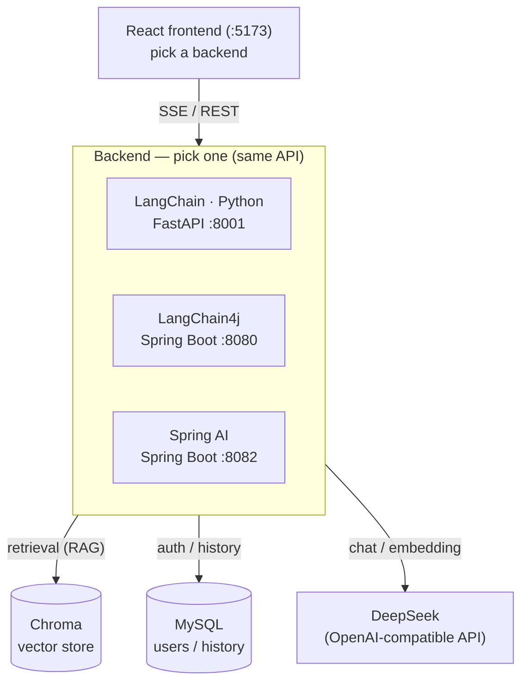

English | [简体中文](README.md)

# personal-knowledge-assistant

A **personal knowledge-base assistant**, available in **three implementations**:
**LangChain (Python) / LangChain4j / Spring AI**. All three expose the same API and share
one frontend and one database — pick whichever fits your stack.

| Implementation | Language / Framework | Port |
|------|----------|------|
| **LangChain (Python)** | Python + FastAPI | 8001 |
| **LangChain4j** | Java 21 + Spring Boot | 8080 |
| **Spring AI** | Java 21 + Spring Boot | 8082 |

## Preview


> Placeholder: save a UI screenshot as `docs/images/screenshot.png` to show it here.

## Architecture



## Features

- Multi-turn chat with streaming output (token-by-token over SSE)
- RAG knowledge-base Q&A (document embedding + retrieval-augmented generation, with sources)
- Agent + tool calling (the model decides whether to search the knowledge base)
- Structured output (free text → typed JSON)
- User system: register / login (JWT), conversation history, rename, delete (soft delete)
- One React frontend works with all three backends (switch via a dropdown)

## Tech stack

- LLM: any OpenAI-compatible model (DeepSeek by default)
- Vector store: Chroma
- Embeddings: local BGE-small-zh (Python / LangChain4j) / all-MiniLM-L6-v2 (Spring AI)
- Relational DB: MySQL (users & conversation history)
- Frontend: React + Vite

## Quick start

1. **Environment variables**
   ```bash
   cp .env.example .env
   # fill in DEEPSEEK_API_KEY, MySQL connection, JWT_SECRET, etc.
   ```
2. **Create the database** (the user system needs MySQL)
   ```bash
   mysql -u root -p < db/schema.sql
   ```
3. **Start Chroma** (vector store)
   ```bash
   ./scripts/start-chroma.sh
   ```
4. **Start any one backend** (choose by your stack)
   ```bash
   ./scripts/start-python.sh        # 8001
   ./scripts/start-langchain4j.sh   # 8080
   ./scripts/start-springai.sh      # 8082
   ```
5. **Ingest the RAG corpus**: Python runs `./scripts/ingest-python.sh`; the two Java backends call `POST /ingest`
6. **Start the frontend**
   ```bash
   cd frontend && npm install && npm run dev   # http://localhost:5173
   ```

See each implementation's own README for API details.

## License

[MIT](LICENSE)
