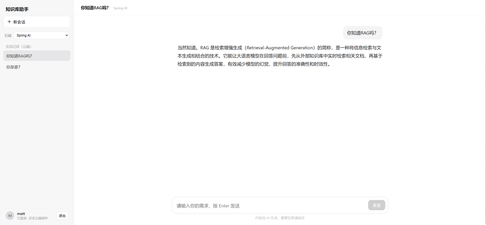
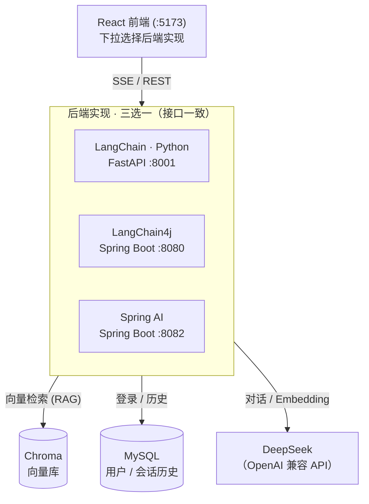

[English](README.en.md) | 简体中文

# 🤖 个人知识库助手 · 三种实现

> 同一个**全栈 RAG 知识库助手**，分别用 **LangChain (Python)、LangChain4j、Spring AI** 三大主流框架各实现一遍。
> 三套后端接口完全一致，共用一个 React 前端 —— **下拉框实时切换后端，同一句话看三个框架怎么答。**

按你的技术栈选一个，或三个一起跑对着看。

| 实现 | 语言/框架 | 端口 |
|------|----------|------|
| **LangChain (Python)** | Python + FastAPI | 8001 |
| **LangChain4j** | Java 21 + Spring Boot | 8080 |
| **Spring AI** | Java 21 + Spring Boot | 8082 |

## 界面预览



## 架构



## ✨ 亮点

- 🔍 **RAG 知识库问答** —— 文档向量化 + 检索增强生成，回答带来源溯源
- 🛠️ **Agent + 工具调用** —— 模型自己决定要不要查知识库（Function Calling）
- ⚡ **流式输出** —— SSE 逐字推送，像 ChatGPT 一样的打字机效果
- 👤 **完整用户系统** —— JWT 登录、会话历史、重命名、逻辑删除，历史还能当多轮上下文
- 🔄 **一个前端通吃三后端** —— 接口统一，下拉切换零成本
- 🧩 **可插拔** —— LLM（任意 OpenAI 兼容，默认 DeepSeek）、向量库（Chroma）、Embedding 都能换
- 📦 **结构化输出** —— 自由文本 → 强类型 JSON

## 技术栈

- 大模型：任意 OpenAI 兼容模型（默认 DeepSeek）
- 向量库：Chroma
- Embedding：本地 BGE-small-zh（Python / LangChain4j）/ all-MiniLM-L6-v2（Spring AI）
- 关系库：MySQL（用户与会话历史）
- 前端：React + Vite

## 目录

```
.
├── .env.example                    环境变量模板（复制为 .env 填值）
├── db/schema.sql                   MySQL 建表（users / conversations / messages）
├── docs/
│   ├── 用户系统-登录与历史.md        用户系统设计与实现
│   ├── 选型参考-Embedding与向量库.md  Embedding / 向量库选型建议
│   └── knowledge/                  RAG 语料（应用启动后入库）
├── 1-langchain-python-version/     LangChain (Python) 实现 + README
├── 2-langchain4j-version/          LangChain4j 实现 + README
├── 3-springai-version/             Spring AI 实现 + README
├── frontend/                       React 前端（三后端共用）
└── scripts/                        启动 / 入库脚本
```

## 快速开始

1. **准备环境变量**
   ```bash
   cp .env.example .env
   # 填入 DEEPSEEK_API_KEY、MySQL 连接、JWT_SECRET 等
   ```
2. **建库**（用户系统需要 MySQL）
   ```bash
   mysql -u root -p < db/schema.sql
   ```
3. **启动 Chroma**（向量库）
   ```bash
   ./scripts/start-chroma.sh
   ```
4. **启动任一后端**（按你的技术栈选一个即可）
   ```bash
   ./scripts/start-python.sh        # 8001
   ./scripts/start-langchain4j.sh   # 8080
   ./scripts/start-springai.sh      # 8082
   ```
5. **入库 RAG 语料**：Python 版跑 `./scripts/ingest-python.sh`；两个 Java 版调 `POST /ingest`
6. **启动前端**
   ```bash
   cd frontend && npm install && npm run dev   # http://localhost:5173
   ```

各实现的接口与细节见对应目录下的 README。

## 许可证

[MIT](LICENSE)
